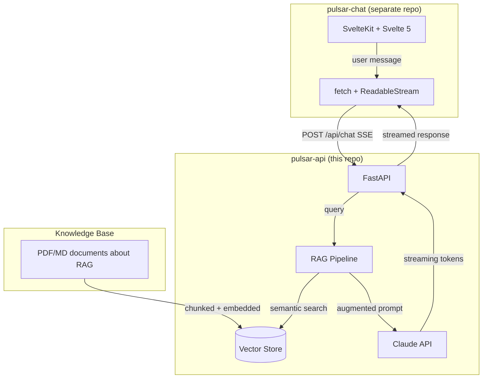
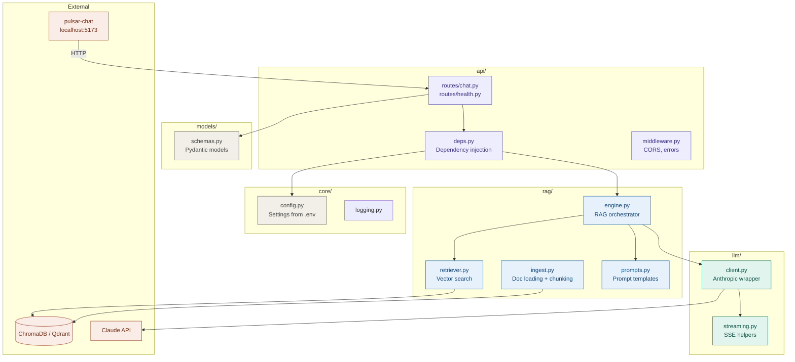
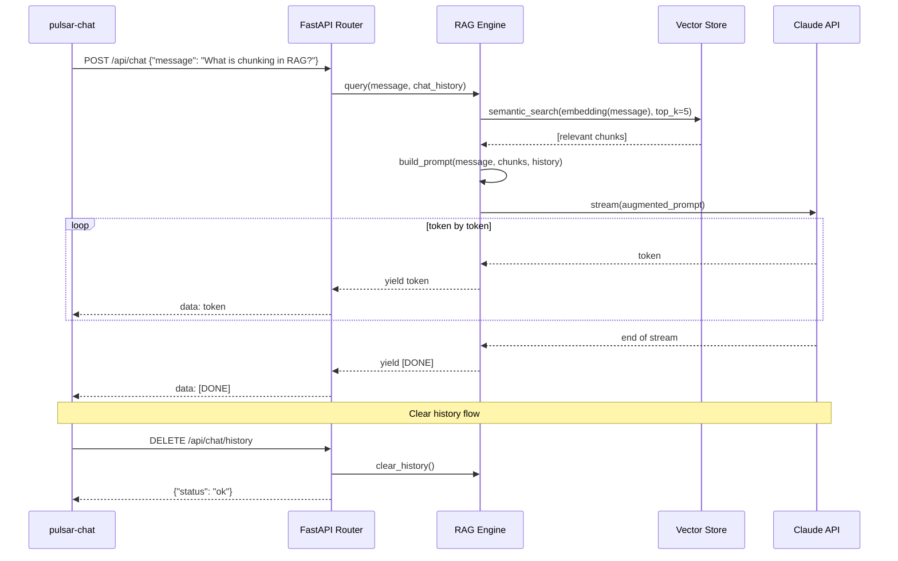
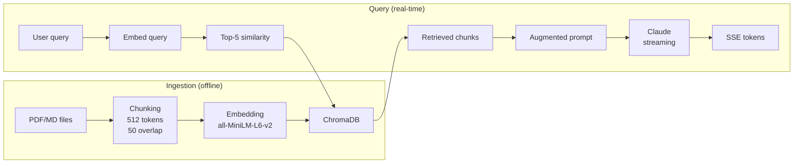
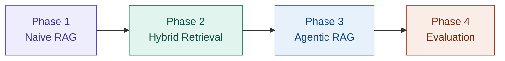
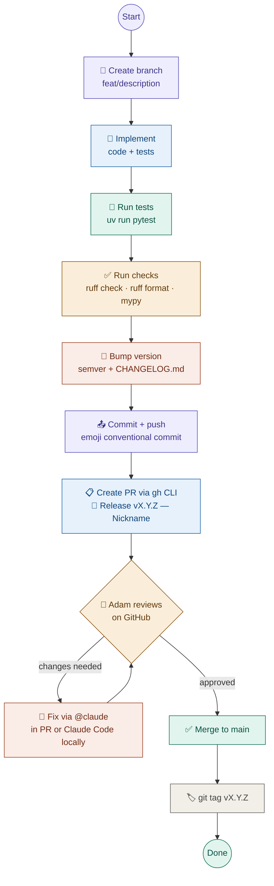

# Architecture & Vision

> This document captures the big picture for pulsar-api — the RAG backend powering the Pulsar
> learning project. Claude Code should read this when working on anything that touches architecture,
> cross-repo concerns, or when it needs to understand the "why" behind a technical choice.

## Why This Project Exists

Pulsar is a **learning project** with three parallel goals:

1. **Learn RAG end-to-end** — not by reading tutorials, but by building a complete retrieval-augmented generation system from scratch. Chunking, embeddings, vector stores, retrieval strategies, re-ranking, evaluation — the full pipeline.

2. **Learn Svelte 5 & modern frontend** — coming from a Python/backend background (FastAPI, AWS, distributed systems), this is an opportunity to build real frontend skills with the latest tools: SvelteKit, Svelte 5 runes, Tailwind CSS 4, Bun.

3. **Learn Anthropic tooling** — Claude Code, Claude Chat, Cowork, CLAUDE.md, skills, MCP integrations. Use the tools to build the project, and learn the tools by building the project.

The meta-strategy: **the RAG knowledge base will contain documents about RAG itself**. We learn RAG by asking our RAG system questions about RAG. When retrieval fails, we immediately understand why — because we know the source material.

## System Overview

The project is split into two repositories that work together:



| Repo            | Purpose                          | Stack                                                                    |
| --------------- | -------------------------------- | ------------------------------------------------------------------------ |
| **pulsar-chat** | Chat UI with streaming           | SvelteKit, Svelte 5, Tailwind 4, Bun, TypeScript                         |
| **pulsar-api**  | RAG pipeline + LLM orchestration | Python, FastAPI, LlamaIndex, ChromaDB → Qdrant, Anthropic SDK            |

### Why Two Repos?

- Different languages (TypeScript vs Python) with different toolchains, linters, and test runners
- Independent deployment — frontend is a static build, backend is a Python service
- Clean separation of concerns — frontend knows nothing about RAG internals
- Both are Dockerized — each repo ships its own image

## Internal Architecture



### Dependency Flow

```
routes (thin handlers) → deps (injection) → engine (orchestration) → retriever + llm client → external services
```

No circular imports. Routes never import from `rag` directly — always through `deps.py`.

## API Contract

### Endpoints

| Method | Path                | Description                         | Request                    | Response                                              |
| ------ | ------------------- | ----------------------------------- | -------------------------- | ----------------------------------------------------- |
| POST   | `/api/chat`         | Send message, get streamed response | `{ "message": "string" }`  | SSE stream: `data: token\n\n` ... `data: [DONE]\n\n`  |
| DELETE | `/api/chat/history` | Clear conversation history          | —                          | `{ "status": "ok" }`                                  |
| GET    | `/api/health`       | Health check                        | —                          | `{ "status": "ok", "rag_ready": bool }`               |

### SSE Stream Format

```
data: Hello
data:  there
data: ,
data:  how can I help?
data: [DONE]
```

Each `data:` line contains one or more tokens. The frontend reads these via `ReadableStream` and
appends them to the current assistant message in real-time.

### Request Flow



## RAG Pipeline Design

### Phase 1: Naive RAG (current target)



Components:

- **Document loader:** PyMuPDF for PDFs, plain read for Markdown
- **Chunking:** LlamaIndex `SentenceSplitter` (recursive character splitter)
- **Embeddings:** `sentence-transformers/all-MiniLM-L6-v2` (local, free, fast)
- **Vector store:** ChromaDB (in-memory or persistent, zero external deps)
- **LLM:** Claude via Anthropic Python SDK (streaming)
- **Prompt template:** System prompt with retrieved context + conversation history

### Phase 2: Hybrid Retrieval (weeks 3-4)

- Add BM25 lexical search alongside semantic search
- Two-stage retrieval: broad fetch (top-50) → cross-encoder re-ranking (top-5)
- Metadata filtering (source, date, category)
- Experiment with chunking strategies: semantic chunking, parent-child chunks

### Phase 3: Agentic RAG (weeks 5-6)

- LLM agent decides when and what to retrieve (tool-use pattern)
- Query reformulation — agent rewrites vague queries before searching
- Multi-step retrieval loops with validation
- LangGraph for stateful agent workflows

### Phase 4: Evaluation (ongoing)

- RAGAs framework — faithfulness, answer relevancy, context precision
- Build eval dataset from the knowledge base
- Automated regression testing for retrieval quality
- A/B testing different retrieval strategies



### Dataset

The knowledge base consists of **documents about RAG itself**:

- Research papers (Lewis et al. 2020 original RAG paper, etc.)
- Framework documentation (LlamaIndex, LangChain)
- Blog posts and tutorials about RAG patterns
- Evaluation methodology papers

This creates a recursive learning loop — when the RAG system fails to answer a question about RAG, we immediately understand what went wrong because we know the source material.

## Key Code Patterns

### Configuration (pydantic-settings)

```python
# core/config.py
from pydantic_settings import BaseSettings

class Settings(BaseSettings):
    anthropic_api_key: str
    model_name: str = "claude-sonnet-4-6"
    chroma_persist_dir: str = "./data/chroma"
    embedding_model: str = "sentence-transformers/all-MiniLM-L6-v2"
    chunk_size: int = 512
    chunk_overlap: int = 50
    top_k: int = 5
    log_level: str = "INFO"
    cors_origins: str = "http://localhost:5173"

    model_config = {"env_file": ".env"}
```

### Dependency Injection

```python
# api/deps.py
from functools import lru_cache
from core.config import Settings
from rag.engine import RAGEngine

@lru_cache
def get_settings() -> Settings:
    return Settings()

def get_rag_engine(settings: Settings = Depends(get_settings)) -> RAGEngine:
    return RAGEngine(settings)
```

### Chat History (in-memory)

```python
# Simple in-memory store — no database needed
_chat_history: dict[str, list[dict[str, str]]] = {"default": []}

def get_history(session_id: str = "default") -> list[dict[str, str]]:
    return _chat_history.setdefault(session_id, [])

def clear_history(session_id: str = "default") -> None:
    _chat_history[session_id] = []
```

No database, no persistence across restarts. This is intentional — complexity budget goes to RAG, not user management.

## Technology Decisions

### Why LlamaIndex (not LangChain)?

- Better document ingestion and indexing out of the box
- More opinionated about retrieval strategies (less boilerplate)
- Cleaner abstraction for "query engine" pattern
- Naive RAG in ~15 lines vs ~40 in LangChain
- Can always drop down to raw components when needed
- For Phase 3 (agentic), LangGraph will be added alongside

### Why uv (not pip/poetry)?

- Fastest Python package manager available (10-100x faster than pip)
- Built-in virtual environment management (`uv sync` creates .venv automatically)
- Lock file (`uv.lock`) for reproducible builds
- Drop-in replacement for pip workflows
- Same philosophy as Bun for JS — fast, modern, all-in-one

### Why FastAPI's native SSE (not sse-starlette)?

- FastAPI 0.115+ has built-in `EventSourceResponse` with `ServerSentEvent`
- Handles keep-alive pings, cache headers, proxy buffering automatically
- No extra dependency needed
- Pydantic model support out of the box

### Why ChromaDB first?

- Zero infrastructure — runs in-process, Python-native
- Perfect for learning and prototyping
- Easy migration path to Qdrant when ready for production features
- Persistent storage with a single flag change

### Why sentence-transformers locally?

- Free — no API costs during development
- Fast — runs on CPU, sub-second for single queries
- Good enough for learning — `all-MiniLM-L6-v2` is a solid baseline
- Can switch to Voyage AI or OpenAI embeddings later

### Why Docker?

- Reproducible environments across dev machines
- `docker compose up` runs the full stack (chat + api) with one command
- Foundation for future CI/CD pipeline
- Production-like setup from day one

## Development Workflow

### Feature Lifecycle



### Roles

| Step                                                      | Who                                                 | Tool                       |
| --------------------------------------------------------- | --------------------------------------------------- | -------------------------- |
| Branch, implement, test, check, version, commit, push, PR | Claude Code                                         | Terminal / WebStorm plugin |
| Code review                                               | Adam                                                | GitHub PR interface        |
| Fix review comments                                       | Claude (via `@claude` in PR) or Claude Code locally | GitHub App / Terminal      |
| Approve + merge + tag                                     | Adam                                                | GitHub                     |

### PR Review with @claude on GitHub

When Adam leaves review comments on a PR, he can tag `@claude` directly in the comment.
The Claude GitHub App will read the feedback, make the fix, and push a commit to the PR branch automatically.
This avoids switching back to the terminal for minor fixes.

For larger changes, Adam returns to Claude Code locally, reads the review with `gh pr view --comments`,
and works through the feedback interactively.

## Future Considerations

Things we explicitly decided NOT to do yet, but might revisit:

- **CI/CD** — no pipeline yet. Docker images are built locally. Will set up GitHub Actions when there's a deployment target.
- **Authentication** — not needed for a local learning project. If this ever goes beyond localhost, add it.
- **Database** — not needed now. If chat history needs persistence, SQLite via SQLModel.
- **Rate limiting** — not needed for single user.
- **Caching** — embed query cache could help in Phase 2.
- **Observability** — LangWatch or LangSmith for RAG tracing in Phase 4.
- **Multiple conversations** — single chat thread only. No conversation list, no tabs.
- **Deployment** — no hosting planned. Everything runs on localhost via Docker.
